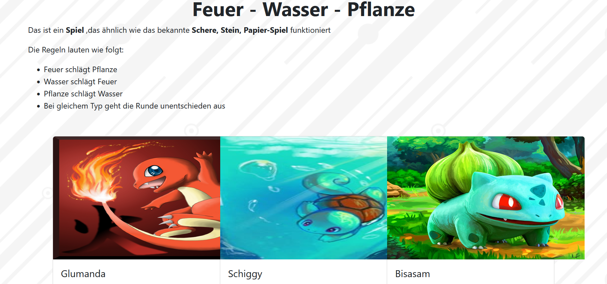
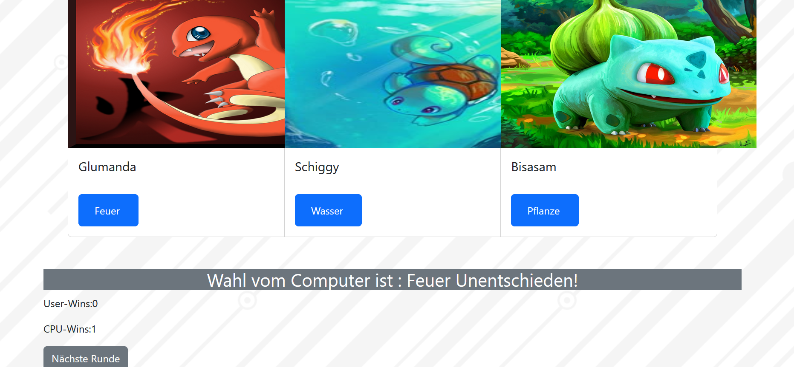

# 🔥💧🌿 Feuer - Wasser - Pflanze Spiel

Ein simples, unterhaltsames Web-Spiel nach dem Prinzip von **"Schere, Stein, Papier"** mit Pokémon-Charakteren:  
**Glumanda (Feuer)**, **Schiggy (Wasser)** und **Bisasam (Pflanze)**.

👉 [Jetzt online spielen](https://DanielleKami.github.io/Feuer-Wasser-Pflanze)

---

## 📜 Spielregeln

- **Feuer** schlägt **Pflanze**
- **Wasser** schlägt **Feuer**
- **Pflanze** schlägt **Wasser**
- Gleiche Auswahl = **Unentschieden**

---

## 🛠️ Technologien

- HTML5
- CSS (Bootstrap 5)
- JavaScript
- GitHub Pages (für Deployment)

---

## ▶️ Projekt starten

1. Öffne die `index.html` im Browser  
   **oder**  
2. Spiele direkt hier:  
   🔗 [https://DEIN_NUTZERNAME.github.io/feuer-wasser-pflanze](https://DanielleKami.github.io/Feuer-Wasser-Pflanze)

---

## 🖼️ Vorschau


  
 |


## 📂 Projektstruktur

```text
├── index.html       # Hauptseite des Spiels
├── spiel.js         # Spiel-Logik in JavaScript
└── README.md        # Projektbeschreibung
